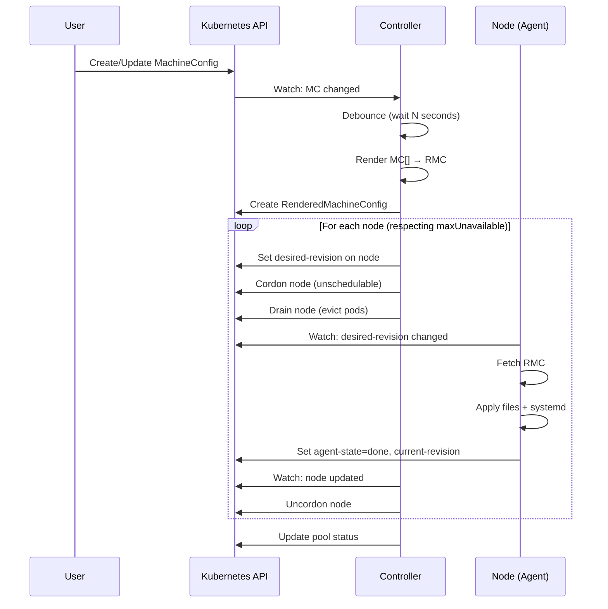

# Архитектура MCO Lite

MCO Lite состоит из двух основных компонентов: **Controller** и **Agent**.

---

## Общая схема

```
                          ┌─────────────────────────────────────┐
                          │          Kubernetes API             │
                          │  ┌─────┐ ┌─────┐ ┌─────┐ ┌──────┐   │
                          │  │ MC  │ │ MCP │ │ RMC │ │ Node │   │
                          │  └──┬──┘ └──┬──┘ └──┬──┘ └──┬───┘   │
                          └────┼───────┼───────┼───────┼────────┘
                               │       │       │       │
         ┌─────────────────────┼───────┼───────┼───────┼──────────────┐
         │                     ▼       ▼       ▼       │              │
         │  CONTROLLER   ┌──────────────────────┐      │              │
         │  (Deployment) │      Renderer        │      │              │
         │               │  MC[] → RMC + hash   │      │              │
         │               └──────────┬───────────┘      │              │
         │                          │                  │              │
         │               ┌──────────▼───────────┐      │              │
         │               │ Pool Overlap Detect  │ checks all         │
         │               │ node ↔ pools match   │ pools              │
         │               └──────────┬───────────┘                     │
         │                          │                  │              │
         │               ┌──────────▼───────────┐      │              │
         │               │   Rollout Manager    │      │              │
         │               │ maxUnavailable + CDU │──────┘              │
         │               └──────────┬───────────┘   writes            │
         │                          │            annotations          │
         │               ┌──────────▼───────────┐    cordon           │
         │               │   Cordon/Drain Mgr   │    drain            │
         │               │   PDB-aware evict    │                     │
         │               └──────────┬───────────┘                     │
         │                          │                                 │
         │               ┌──────────▼───────────┐                     │
         │               │  Status Aggregator   │◄─────┐              │
         │               │ pool status + conds  │      │              │
         │               └──────────────────────┘      │ reads        │
         └─────────────────────────────────────────────┼──────────────┘
                                                       │
    ┌──────────────────────────────────────────────────┼──────────────┐
    │  AGENT (DaemonSet, per node)                     │              │
    │                                                  │              │
    │  ┌──────────────┐    ┌──────────────┐    ┌───────┴──────┐       │
    │  │  Node Watch  │───▶│   Applier    │───▶│State Reporter│       │
    │  │  (own node)  │    │ files+systemd│    │  annotations │       │
    │  └──────────────┘    └──────────────┘    └──────────────┘       │
    │                                                                 │
    └─────────────────────────────────────────────────────────────────┘
```

---

## Controller

Controller запускается как **Deployment** (обычно 1 реплика) и отвечает за:

> **Resilience:** Controller имеет tolerations для cordoned/not-ready/unreachable нод,
> что позволяет ему работать даже когда все worker-ноды недоступны.
> Также Controller никогда не drain'ит ноду на которой сам работает.

### Renderer

**Задача:** Создать единую конфигурацию из множества MachineConfig.

```
MachineConfig (priority: 30)  ─┐
MachineConfig (priority: 50)  ─┼──▶ RenderedMachineConfig
MachineConfig (priority: 70)  ─┘    (merged + hash)
```

**Алгоритм:**
1. Выбрать MachineConfig по `machineConfigSelector` пула
2. Отсортировать по приоритету (меньший → больший)
3. При равном приоритете — по имени (меньшее → большее)
4. Слить файлы и systemd-юниты (последний побеждает)
5. Вычислить SHA256 хеш результата
6. Создать RenderedMachineConfig с именем `rendered-<pool>-<hash[:10]>`

### Rollout Manager

**Задача:** Управлять раскаткой конфигурации на ноды с учётом maxUnavailable.

- Применяет **debounce** — ждёт N секунд после изменения перед рендером
- Вычисляет сколько нод можно обновлять одновременно
- Записывает `desired-revision` в аннотации только тех нод, которые можно обновить
- Контролирует скорость раскатки через `maxUnavailable`

**Алгоритм выбора нод для обновления:**
```
canUpdate = maxUnavailable - currentlyUnavailable
needsUpdate = nodes where current-revision != target-revision
selectedNodes = first(canUpdate, needsUpdate)
```

### Cordon/Drain Manager

**Задача:** Безопасно подготовить ноду к обновлению.

**Последовательность:**
1. **Проверка self-node** — если это нода Controller'а, пропустить cordon/drain
2. **Cordon** — пометить ноду как `unschedulable`, записать аннотацию `mco.in-cloud.io/cordoned=true`
3. **Drain** — эвакуировать поды с учётом PodDisruptionBudget
4. При ошибке drain — повторять с backoff, эмитить событие `DrainFailed`
5. Если drain занимает слишком долго — установить condition `DrainStuck`

**Self-node protection:**
Controller определяет свою ноду через переменную окружения `NODE_NAME` (Downward API).
Для self-node конфигурация применяется без cordon/drain, чтобы избежать deadlock.

**Drain параметры:**
- `drainTimeoutSeconds` — максимальное время ожидания (default: 3600s)
- `drainRetrySeconds` — интервал между попытками (default: auto)

**MCO pods exclusion:**
Поды из namespace `machine-config-system` исключаются из eviction при drain.

### Pool Overlap Detector

**Задача:** Обнаружить ноды, которые попадают в несколько пулов.

- Проверяет nodeSelector каждого пула
- Если нода матчит > 1 пула — записывает condition `PoolOverlap`
- Блокирует обновления для конфликтующих нод

### Status Aggregator

**Задача:** Агрегировать состояние нод в статус пула.

Читает аннотации нод и вычисляет:
- `machineCount` — всего нод
- `readyMachineCount` — ноды с applied конфигом
- `updatedMachineCount` — ноды с target revision
- `updatingMachineCount` — ноды в процессе applying
- `degradedMachineCount` — ноды с ошибками
- `cordonedMachineCount` — cordoned ноды
- `drainingMachineCount` — ноды в процессе drain
- `pendingRebootCount` — ноды, ожидающие перезагрузки

**Условия пула (Conditions):**
- `Ready` — главный индикатор: True когда все ноды обновлены и нет ошибок
- `Updating` — True когда есть ноды не на target revision
- `Draining` — True когда выполняется drain на нодах
- `Degraded` — True при ошибках (ноды или рендеринг)
- `PoolOverlap` — True при overlap нод между пулами
- `DrainStuck` — True при timeout drain

---

## Agent

Agent запускается как **DaemonSet** на каждой ноде и отвечает за:

> **Важно:** Agent — это node-scoped демон, НЕ Kubernetes-контроллер.
> Он видит только свою ноду и не знает о других.

### Node Watch

**Задача:** Следить за аннотациями своей ноды.

```go
// Agent смотрит только на свою ноду
fieldSelector: metadata.name=<node-name>
```

Когда `desired-revision` меняется — запускает Applier.

### Applier

**Задача:** Применить конфигурацию на хост.

**Для файлов:**
1. Создать директорию (если не существует)
2. Записать файл атомарно (write to temp → rename)
3. Установить права и владельца
4. Для `state: absent` — удалить файл

**Для systemd:**
1. `systemctl enable/disable <unit>`
2. `systemctl start/stop/restart/reload <unit>`
3. Для `mask: true` — `systemctl mask <unit>`

### State Reporter

**Задача:** Сообщать о состоянии через аннотации.

| Аннотация | Описание |
|-----------|----------|
| `current-revision` | Последняя успешно применённая ревизия |
| `agent-state` | Текущее состояние: `idle`, `applying`, `done`, `error` |
| `last-error` | Текст ошибки (если `state=error`) |
| `reboot-pending` | `true` если требуется перезагрузка |

---

## Контракт аннотаций

**Принцип:** Controller пишет DESIRED, Agent пишет OBSERVED.

### Пишет Controller

| Аннотация | Пример значения | Описание |
|-----------|-----------------|----------|
| `mco.in-cloud.io/desired-revision` | `rendered-worker-a1b2c3d4e5` | Целевая ревизия |
| `mco.in-cloud.io/pool` | `worker` | Имя пула |
| `mco.in-cloud.io/cordoned` | `true` | Нода cordoned |
| `mco.in-cloud.io/drain-started-at` | `2026-01-09T10:00:00Z` | Время начала drain |
| `mco.in-cloud.io/drain-retry-count` | `3` | Количество retry drain |
| `mco.in-cloud.io/desired-revision-set-at` | `2026-01-09T10:00:00Z` | Время установки desired |

### Пишет Agent

| Аннотация | Пример значения | Описание |
|-----------|-----------------|----------|
| `mco.in-cloud.io/current-revision` | `rendered-worker-a1b2c3d4e5` | Текущая ревизия |
| `mco.in-cloud.io/agent-state` | `done` | Состояние агента |
| `mco.in-cloud.io/last-error` | `failed to write /etc/foo` | Текст ошибки |
| `mco.in-cloud.io/reboot-pending` | `true` | Требуется перезагрузка |

---

## Жизненный цикл конфигурации



### Текстовое описание

1. DevOps создаёт MachineConfig
2. Controller видит изменение
3. **[Debounce]** Ждёт N секунд
4. Renderer создаёт RenderedMachineConfig
5. Controller проверяет Pool Overlap
6. Rollout Manager выбирает ноды для обновления (maxUnavailable)
7. Для каждой выбранной ноды:
   - Cordon → Drain → Set desired-revision
8. Agent видит изменение аннотации
9. Agent применяет файлы и systemd
10. Agent записывает current-revision = desired
11. Controller uncordon ноду
12. Status Aggregator обновляет статус пула

---

## Жизненный цикл Rolling Update

```
         Pool: 3 nodes, maxUnavailable=1

Time ───────────────────────────────────────────────────────►

Node 1:  [Cordon] [Drain] [Apply] [Done] [Uncordon]
Node 2:                                   [Cordon] [Drain] [Apply] [Done] [Uncordon]
Node 3:                                                                   [Cordon] ...

         ├─────── 1 unavailable ─────────┤├─────── 1 unavailable ─────────┤
```

---

## Требования к ресурсам

| Компонент | CPU | Memory | Примечание |
|-----------|-----|--------|------------|
| Controller | 100m | 128Mi | На весь кластер |
| Agent | 50m | 64Mi | На каждую ноду |

---

## Следующие шаги

- [Терминология](glossary.md) — ключевые понятия
- [Rolling Update](../user-guide/rolling-update.md) — настройка раскатки
- [Установка](../getting-started/installation.md) — развернуть MCO Lite

