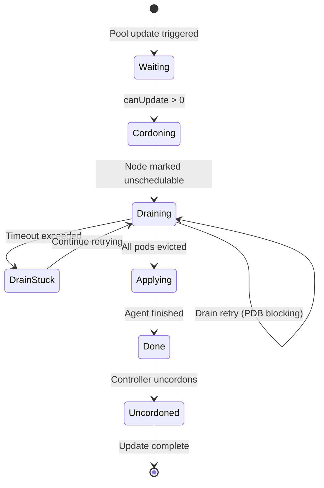

# Rolling Update — Управление раскаткой

Rolling Update позволяет безопасно обновлять ноды группами с контролем количества одновременно недоступных нод.

---

## Обзор

При обновлении конфигурации MCO Lite:

1. **Не обновляет все ноды сразу** — это может привести к недоступности сервисов
2. **Уважает maxUnavailable** — ограничивает количество нод в обновлении
3. **Cordon/Drain** — безопасно эвакуирует поды перед обновлением
4. **Uncordon** — возвращает ноду в работу после успешного обновления

---

## Конфигурация

### Базовая настройка

```yaml
apiVersion: mco.in-cloud.io/v1alpha1
kind: MachineConfigPool
metadata:
  name: worker
spec:
  nodeSelector:
    matchLabels:
      node-role.kubernetes.io/worker: ""
  rollout:
    maxUnavailable: 1           # Обновлять по одной ноде
    debounceSeconds: 30         # Ждать 30с после изменения
    drainTimeoutSeconds: 3600   # Таймаут drain 1 час
```

### maxUnavailable

Определяет максимальное количество нод, которые могут быть недоступны одновременно.

| Значение | Тип | Пример для 10 нод |
|----------|-----|-------------------|
| `1` | Абсолютное число | 1 нода |
| `2` | Абсолютное число | 2 ноды |
| `"10%"` | Процент | 1 нода (ceiling от 10%) |
| `"25%"` | Процент | 3 ноды (ceiling от 25%) |
| `"50%"` | Процент | 5 нод |

```yaml
# Консервативное обновление (production)
rollout:
  maxUnavailable: 1

# Быстрое обновление (dev/staging)
rollout:
  maxUnavailable: "50%"

# Canary-like обновление
rollout:
  maxUnavailable: 1  # Сначала одна нода, потом все остальные
```

### drainTimeoutSeconds

Максимальное время ожидания завершения drain.

```yaml
rollout:
  drainTimeoutSeconds: 3600    # 1 час (default)
```

| Значение | Сценарий использования |
|----------|------------------------|
| 300 (5 мин) | Stateless приложения, быстрая эвакуация |
| 3600 (1 час) | Default, подходит для большинства случаев |
| 7200 (2 часа) | Stateful приложения с длительным graceful shutdown |

**При превышении timeout:**
- Устанавливается condition `DrainStuck`
- Drain **продолжает попытки** (не отменяется)
- Эмитится Kubernetes Event для alerting

### drainRetrySeconds

Интервал между попытками drain.

```yaml
rollout:
  drainTimeoutSeconds: 3600
  drainRetrySeconds: 300    # Retry каждые 5 минут
```

По умолчанию вычисляется как `max(30, drainTimeoutSeconds/12)`, что даёт примерно 12 попыток за timeout.

---

## Последовательность обновления

```
Pool: 3 worker nodes, maxUnavailable=1

Initial state:
  Node 1: current=rev-A, desired=rev-A, state=done
  Node 2: current=rev-A, desired=rev-A, state=done
  Node 3: current=rev-A, desired=rev-A, state=done

New MachineConfig applied → new RMC rev-B created

Step 1: Select Node 1 (unavailable=0, canUpdate=1)
  Node 1: [CORDON] → [DRAIN] → [SET desired=rev-B]
  Node 2: (waiting)
  Node 3: (waiting)

Step 2: Agent applies on Node 1
  Node 1: state=applying
  Node 2: (waiting, unavailable=1, canUpdate=0)
  Node 3: (waiting)

Step 3: Node 1 done
  Node 1: current=rev-B, state=done → [UNCORDON]
  Node 2: (now can start, unavailable=0)
  Node 3: (waiting)

Step 4: Select Node 2
  Node 1: (updated)
  Node 2: [CORDON] → [DRAIN] → [SET desired=rev-B]
  Node 3: (waiting)

... и так далее для Node 3 ...

Final state:
  Node 1: current=rev-B, state=done
  Node 2: current=rev-B, state=done
  Node 3: current=rev-B, state=done
```

---

## Диаграмма состояний



---

## Мониторинг Rolling Update

### Статус пула

```bash
kubectl get mcp worker -o yaml
```

```yaml
status:
  machineCount: 10
  updatedMachineCount: 3      # 3 из 10 на новой ревизии
  updatingMachineCount: 1     # 1 нода применяет
  cordonedMachineCount: 1     # 1 нода cordoned
  drainingMachineCount: 0     # Drain завершён, идёт apply
  
  conditions:
  - type: Updating
    status: "True"
    reason: RollingUpdate
    message: "3 of 10 nodes updated, 1 updating"
```

### Статус нод

```bash
kubectl get nodes -o custom-columns=\
NAME:.metadata.name,\
SCHED:.spec.unschedulable,\
CORDONED:.metadata.annotations.mco\.in-cloud\.io/cordoned,\
STATE:.metadata.annotations.mco\.in-cloud\.io/agent-state,\
REVISION:.metadata.annotations.mco\.in-cloud\.io/current-revision
```

```
NAME     SCHED   CORDONED   STATE      REVISION
node-1   <none>  <none>     done       rendered-worker-b2c3d4e5f6
node-2   true    true       applying   rendered-worker-a1b2c3d4e5
node-3   <none>  <none>     done       rendered-worker-a1b2c3d4e5
```

### События

```bash
kubectl get events --field-selector reason=RollingUpdate
```

---

## Обработка ошибок

### DrainStuck — PDB блокирует эвакуацию

**Симптом:** Condition `DrainStuck` = True

```bash
kubectl get mcp worker -o jsonpath='{.status.conditions[?(@.type=="DrainStuck")]}'
```

**Причины:**
- PodDisruptionBudget не позволяет эвакуировать поды
- Под не завершается (зависает в Terminating)
- Под не имеет другой ноды для миграции

**Решение:**
1. Проверить PDB: `kubectl get pdb -A`
2. Проверить поды на ноде: `kubectl get pods -A --field-selector spec.nodeName=<node>`
3. При необходимости — вручную удалить или перенастроить PDB

### Нода застряла в Cordoned

**Симптом:** Нода cordoned, но drain не завершается

```bash
# Проверить статус drain
kubectl get node <name> -o jsonpath='{.metadata.annotations}'
```

**Действия:**
1. Подождать drainTimeoutSeconds
2. Проверить логи контроллера
3. При необходимости — вручную uncordon и расследовать

### Агент не применяет конфигурацию

**Симптом:** `agent-state = applying` долгое время

```bash
# Логи агента
kubectl logs -n mco-system -l app=mco-agent --field-selector spec.nodeName=<node>
```

---

## Best Practices

### 1. Начинайте с maxUnavailable=1

```yaml
rollout:
  maxUnavailable: 1
```

Это самый безопасный вариант — проблемы обнаружатся на одной ноде.

### 2. Используйте PDB для критичных приложений

```yaml
apiVersion: policy/v1
kind: PodDisruptionBudget
metadata:
  name: my-app-pdb
spec:
  minAvailable: 2
  selector:
    matchLabels:
      app: my-critical-app
```

### 3. Настройте разумный drainTimeoutSeconds

```yaml
# Для stateless приложений
drainTimeoutSeconds: 600    # 10 минут

# Для stateful приложений
drainTimeoutSeconds: 3600   # 1 час
```

### 4. Мониторьте DrainStuck

```yaml
# Prometheus Alert
- alert: MCODrainStuck
  expr: mco_drain_stuck_total > 0
  for: 5m
  labels:
    severity: warning
  annotations:
    summary: "MCO drain stuck on pool {{ $labels.pool }}"
```

### 5. Используйте paused для ручного контроля

```yaml
spec:
  paused: true  # Остановить rollout
```

```bash
# Посмотреть текущее состояние
kubectl get mcp worker

# Продолжить rollout
kubectl patch mcp worker --type=merge -p '{"spec":{"paused":false}}'
```

---

## Примеры

### Консервативный production

```yaml
apiVersion: mco.in-cloud.io/v1alpha1
kind: MachineConfigPool
metadata:
  name: production-workers
spec:
  nodeSelector:
    matchLabels:
      node-role.kubernetes.io/worker: ""
  rollout:
    maxUnavailable: 1           # По одной ноде
    debounceSeconds: 60         # Большая задержка
    drainTimeoutSeconds: 7200   # 2 часа на drain
    applyTimeoutSeconds: 900    # 15 минут на apply
  reboot:
    strategy: Never             # Только ручные перезагрузки
```

### Быстрый staging

```yaml
apiVersion: mco.in-cloud.io/v1alpha1
kind: MachineConfigPool
metadata:
  name: staging-workers
spec:
  nodeSelector:
    matchLabels:
      environment: staging
  rollout:
    maxUnavailable: "50%"       # Половина нод сразу
    debounceSeconds: 5          # Быстрый debounce
    drainTimeoutSeconds: 300    # 5 минут timeout
  reboot:
    strategy: IfRequired        # Авто-перезагрузка
```

---

## Связанные документы

- [Cordon/Drain](cordon-drain.md) — детали процесса эвакуации
- [MachineConfigPool](machineconfigpool.md) — полная спецификация
- [Мониторинг статуса](status-monitoring.md) — отслеживание состояния
- [Устранение проблем](troubleshooting.md) — диагностика ошибок

